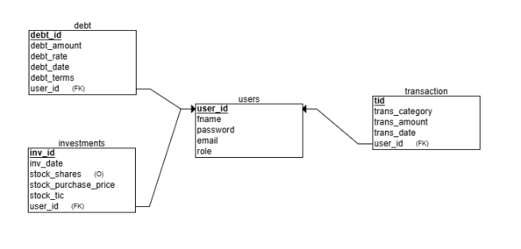
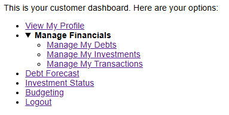
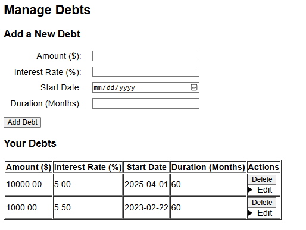
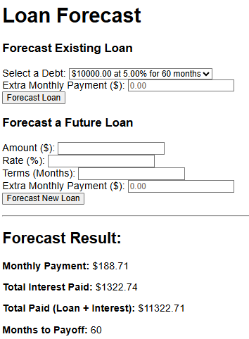
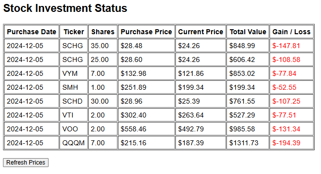
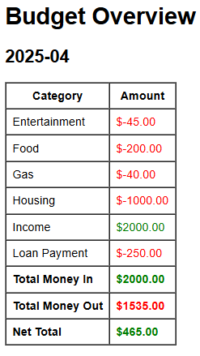

## 🧮 Financial Planning Application by Jacob Parker

### 🔍 Overview

The goal of this project is to create a user-friendly **financial planning application** where users can store and retrieve non-sensitive financial data. The application allows users to input a variety of financial details—including **transactions**, **investments**, and **debts**—which are securely stored in a **MySQL** database. This data is then presented back to users in multiple formats, helping them assess their current financial standing with clarity and ease.

  

---

### 🧭 Main Features

The application includes **four main pages**, each designed to serve a specific financial planning purpose:

  

---

#### 📊 Manage Financials  
A comprehensive interface where users can:
- Add, update, or delete **investments**, **debts**, and **transactions**  
- Use this as the primary tool for entering and organizing financial records

  

---

#### 📉 Debt Forecast  
A forecasting tool that:
- Calculates **monthly payments**, **remaining balances**, and generates an **amortization schedule** based on stored debt  
- Allows users to simulate **potential new loans** and view projected payment details  
- Supports **extra monthly payments**, showing how additional payments can impact payoff timelines

  

---

#### 📈 Investments  
An investment tracking dashboard that:
- Displays detailed tables of each user's **investment portfolio**  
- Provides basic information about each asset  
- Retrieves **real-time valuations** of stocks and bonds  
- Offers a quick snapshot of **investment performance**, including gains and losses

  

---

#### 🧾 Budgeting  
A budget overview that helps users understand their spending habits:
- Breaks down expenses by category (e.g., rent, food, transportation)  
- Includes income, dividends, and loan payments as transactions to give a full monthly overview

  

#### 🔐 Login Credentials
<table align="left"> <thead> <tr> <th>Role</th> <th>Username</th> <th>Password</th> </tr> </thead> <tbody> <tr> <td>👨‍💼 Admin</td> <td><code>a@a.com</code></td> <td><code>ABC123</code></td> </tr> <tr> <td>👤 Customer</td> <td><code>b@b.com</code></td> <td><code>123456</code></td> </tr> </tbody> </table>