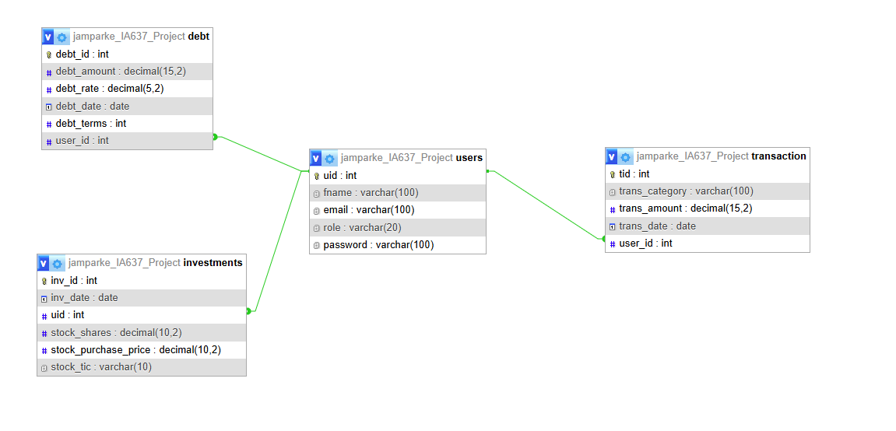

## 🧮 Financial Planning Application by Jacob Parker

#### 🔐 Login Credentials
## Users

### Admin
- Email: admin@admin.com  
- Password: ABC123  
- Role: admin

### Customer1
- Email: a@a.com  
- Password: 123456  
- Role: customer

### Customer2
- Email: c@c.com  
- Password: 789  
- Role: customer

---

### 🔍 Overview

The goal of this project is to create a user-friendly **financial planning application** where users can store and retrieve non-sensitive financial data. The application allows users to input a variety of financial details—including **transactions**, **investments**, and **debts**—which are securely stored in a **MySQL** database. This data is then presented back to users in multiple formats, helping them assess their current financial standing with clarity and ease.

In addition to user functionality, the application includes an **admin dashboard** that enables administrators to **manage users** and **view analytical reports** across all user accounts.

  

### 🧭 Main Features

The application includes two user roles: **customers** and **admins**, each with access to tailored interfaces and features.

#### 👤 Customer View
Customers have access to **four main pages**, each designed to serve a specific financial planning purpose:

- **Managing Financials** – Add, upadate, and delete debt, investments, or transactions
- **Transactions** – Track and categorize income or expenses
- **Investments** – View stock performance and ROI over time
- **Debts** – Forecast loan payments and remaining balances

  

#### 🔐 Admin View
Admins have access to an administrative dashboard with two primary tools:

- **User Management** – Monitor all users and their data
- **Analytics Reports** – View aggregate trends across all transactions

  

---

#### 📊 Manage Financials  
A comprehensive interface where users can:
- Add, update, or delete **investments**, **debts**, and **transactions**  
- Use this as the primary tool for entering and organizing financial records

  

---

#### 📉 Debt Forecast  
A forecasting tool that:
- Calculates **monthly payments**, **remaining balances**, and generates an **amortization schedule** based on stored debt  
- Allows users to simulate **potential new loans** and view projected payment details  
- Supports **extra monthly payments**, showing how additional payments can impact payoff timelines

  

  

---

#### 📈 Investments  
An investment tracking dashboard that:
- Displays detailed tables of each user's **investment portfolio**  
- Provides basic information about each asset  
- Retrieves **real-time valuations** of stocks and bonds  
- Offers a quick snapshot of **investment performance**, including gains and losses

  

---

#### 🧾 Budgeting  
A budget overview that helps users understand their spending habits:
- Breaks down expenses by category (e.g., rent, food, transportation)  
- Includes income, dividends, and loan payments as transactions to give a full monthly overview

  

---

### 📊 Admin User Spending Report

Admins can access a detailed **User Spending Report** that aggregates transaction data across all users. This report provides:

- **Total and Average Amounts** spent or earned by category
- **Number of users** who reported spending in each category
- A summary view of:
  - **Total Money In**
  - **Total Money Out**
  - **Net Total** across the system

  

